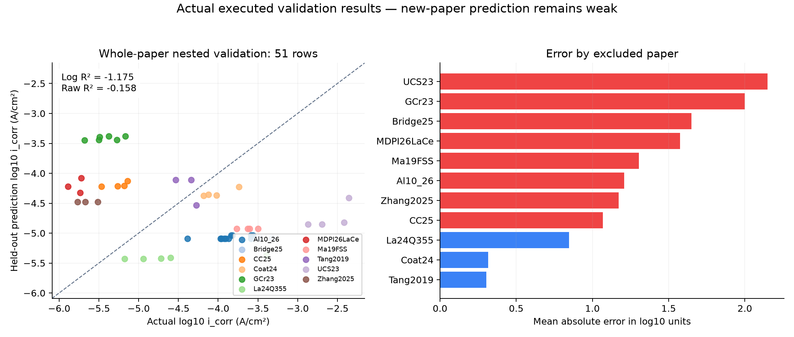

# 희토류-강재 i_corr 실제 실행 결과

2026-10-08 기준. 현재 CSV를 점검하고, 최종 모델을 51행 전체로 다시 학습한 후 저장된 모델을 불러와 51행 예측을 실행했습니다. 아래 성능은 이미 실행 완료한 **논문 단위 중첩 검증** 결과입니다. 현재 데이터의 타겟과 모든 모델 입력이 그 검증에 사용한 데이터와 동일함을 확인했습니다.

## 핵심 결과

| 데이터 | 행/논문 | log10 i_corr R² | 원단위 i_corr R² | log MAE |
|---|---:|---:|---:|---:|
| 기존 주 데이터 | 34/9 | -0.204 | -0.152 | 1.014 |
| 확장 주 데이터 | 51/11 | -1.175 | -0.158 | 1.259 |
| 명목 첨가량 보조 포함 | 54/12 | -0.650 | -0.122 | 0.925 |

**추가 논문을 반영해도 새 논문 예측 성능은 개선되지 않았습니다.** 주 데이터 51행의 log R²는 -1.175, 원단위 R²는 -0.158입니다. R² 음수는 해당 전체 검증 타겟의 평균값을 사용하는 예측보다 제곱오차가 크다는 뜻입니다. 로그 기준과 원단위 기준 점수는 서로 다르며, 퍼센트 정확도로 읽으면 안 됩니다.

주 데이터의 논문 제외 검증에서 행별 실측·예측 차이의 중앙값은 약 **16.8배**입니다. 따라서 현재 모델을 새 합금의 정량 예측에 신뢰할 단계는 아닙니다.

## 무엇을 학습했는가

- 조성: 실제 합금의 RE와 C·Si·Mn·Cr·Ni·Mo·Cu·S·P 등. 3개 컬럼 조합을 비교합니다.
- 제조/공정: 제강·주조·열처리·냉각·압연 상태 및 표면 준비 상태.
- 부식 환경: 전해질 종류/농도, 온도, 가스 조건, 사전 노출시간.
- 타겟: A/cm²로 통일한 i_corr의 log10. 예측을 다시 A/cm²와 µA/cm²로 환산합니다.
- RE의 로그 변환이나 공정 범주 통합을 포함하는 transfer 패널도 비교합니다. 최종 선택된 모델이 실제 사용한 컬럼은 아래에 따로 표시했습니다.
- 미보고값을 실제 0으로 채우지 않습니다. 각 학습 분할 안에서 중앙값 대체와 범주 인코딩을 수행합니다.
- E_corr, Rct, Tafel 기울기, 논문 식별자는 예측 입력에 쓰지 않습니다. 논문 식별자는 분할과 가중치 계산에만 사용합니다.

## 검증 방법

3개 컬럼 조합 × 6개 모델 설정 = 18개 후보를 비교했습니다. 한 논문의 모든 행을 검증용으로 제외하고, 나머지 논문 안에서 다시 논문별 내부 검증으로 후보를 선택합니다. 제외한 논문의 타겟은 후보 선택이나 전처리 적합에 쓰지 않습니다. 모든 바깥 검증 예측을 모아 R²를 계산합니다. 행 수가 많은 논문이 학습을 지배하지 않도록 논문별 가중치를 사용합니다.

`model_comparison.csv`는 같은 검증 결과로 후보를 비교한 탐색 순위표입니다. 그 최고점을 새로운 논문의 최종 성능이라고 보고하면 안 됩니다. 전체 51행으로 최종 모델을 적합한 뒤 그 51행을 다시 예측한 결과도 독립 성능 평가가 아닙니다.

## 현재 저장 모델

- 모델: SVR, 컬럼 패널: compact, 후보 ID: 5
- 수치 입력: RE_wt_pct, C_wt_pct, Cr_wt_pct, Ni_wt_pct, final_heat_treatment_temp_C, final_heat_treatment_time_min, temperature_C, NaCl_wt_pct, Cl_mol_L, H2SO4_mol_L, NaHSO3_mol_L, log_pre_exposure_h
- 범주 입력: RE_element_cat, melting_route_cat, casting_method_cat, cooling_method_cat, processing_state_cat, surface_state_cat, electrolyte_family, gas_condition_cat

## 논문별 오차

| 제외한 논문 | 행 | log MAE | 실측·예측 차이 중앙값 |
|---|---:|---:|---:|
| UCS23 | 4 | 2.150 | 127.9배 |
| GCr23 | 6 | 1.999 | 106.1배 |
| Bridge25 | 3 | 1.650 | 40.2배 |
| MDPI26LaCe | 3 | 1.574 | 44.0배 |
| Ma19FSS | 4 | 1.305 | 20.6배 |
| Al10_26 | 12 | 1.209 | 15.6배 |
| Zhang2025 | 3 | 1.173 | 15.6배 |
| CC25 | 4 | 1.070 | 10.7배 |
| La24Q355 | 5 | 0.846 | 5.1배 |
| Coat24 | 4 | 0.316 | 2.0배 |
| Tang2019 | 3 | 0.304 | 1.8배 |

서로 다른 강종·시험 용액·표면 상태를 함께 다루고 있으며, 핵심 조건이 미보고인 행도 많습니다. 추가된 행만으로 논문 사이의 차이를 학습하기에는 데이터가 부족할 가능성이 있습니다. 이는 실패 원인에 대한 해석이며, 특정 변수의 인과효과를 입증한 결과는 아닙니다.

## 저장 결과

- `51행_독립논문검증_실측예측비교.csv`: 성능 평가에 사용한 실제/예측값, µA/cm², 행별 오차 배수.
- `논문별_검증오차.csv`, `검증성능_요약.csv`: 논문별 오차와 전체 검증 점수.
- `fitted_model_predictions_all51.csv`: 이번에 다시 학습한 저장 모델의 51행 예측. 학습에 사용한 행이므로 독립 검증이 아닙니다.
- `이번_실행기록.json`: 이번 실행 및 기존 검증 결과 재사용 근거.
- `retrained/`: 이미 완료된 전체 중첩 검증 결과 및 각 분할에서 선택한 모델.

## 다음에 필요한 데이터

높은 R²를 목표로 한다면 같은 강종·전해질·표면 상태를 비교할 수 있는 독립 논문을 우선 확보해야 합니다. 실제 잔류 RE 조성, 분극 시험 조건, 수치 i_corr가 함께 보고된 데이터를 수집하고, 새 논문을 통째로 제외하는 검증을 유지해야 합니다. 현재 자료에서 수치를 크게 만들기 위해 논문이 섞이는 무작위 분할로 바꾸는 것은 새 논문 예측 성능을 입증하지 못합니다.
